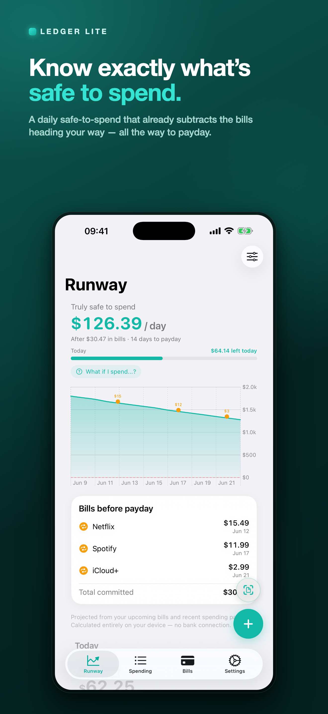
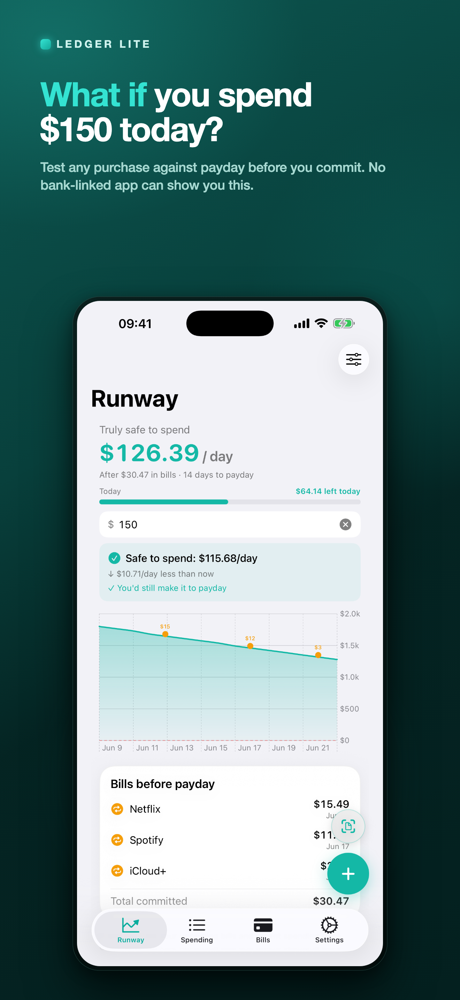
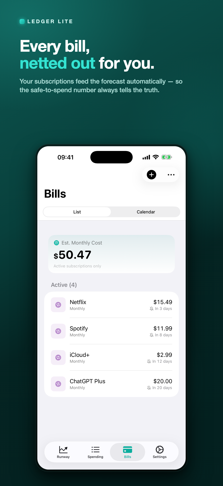
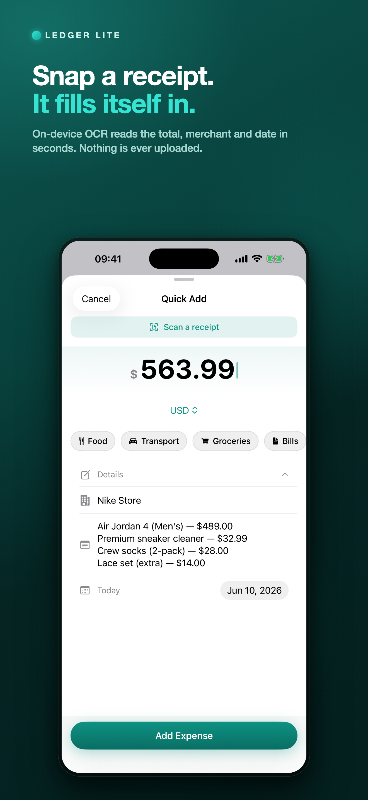
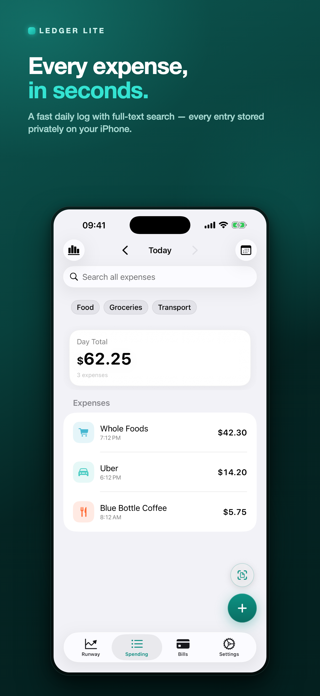

# LedgerLite

A clean, privacy-first expense and subscription tracker for iOS. Built with SwiftUI and SwiftData — no accounts, no cloud required, everything on device.

## Screenshots

<p align="center">
  
  
  
  
  
</p>

## Features

- **Quick Add** — log an expense in seconds with a large amount numpad, category strip, merchant suggestions, and reusable templates
- **Receipt scanning** — point the camera at a receipt (or pick a photo) and on-device Vision OCR pre-fills the amount, merchant, date, and currency. Line items land in the note as an itemized breakdown — including discounts and add-on tax, so the breakdown sums to what you were charged. Works across languages (English, German, Portuguese, Spanish, French, …)
- **Runway forecast** — enter your balance and next payday to get a *truly safe to spend per day* figure, a what-if simulator, and the bills due before payday
- **Spending log** — browse by day, with fast case- and diacritic-insensitive search across all expenses ("cafe" finds "Café") and category filters
- **Bills** — track recurring subscriptions with any billing cycle, pause/resume/cancel, see the estimated monthly cost, and get reminders 2 days before each renewal
- **Auto-detect** — paste a billing email or SMS and the app extracts the subscription details
- **Insights** — spending by category, daily/monthly trends, budget progress, daily heatmap, and top merchant — across week, month, year, or all time
- **Budgets** — monthly limits per category with alerts at 80% and 100%
- **Multi-currency done right** — amounts are stored as integer minor units with the exchange rate frozen at entry, so historical totals never drift. Switching home currency re-converts your history at each expense's own historical rate. Live rates come from Frankfurter with an automatic fallback provider
- **Siri & Shortcuts** — "Log an expense" and "What's today's total" work hands-free
- **Widgets** — Today total, Runway safe-to-spend, and upcoming Bills on your Home Screen or Lock Screen
- **Face ID lock** — optional biometric lock, with a privacy cover so balances never show in the app switcher
- **Spotlight** — logged expenses are searchable from system-wide search
- **CSV backup** — export expenses and subscriptions; re-import expenses on a new device

Privacy: there are no accounts, no analytics, and no servers. The only network traffic is fetching exchange rates from keyless public APIs.

## Requirements

- iOS 17.0+
- Xcode 16+
- [XcodeGen](https://github.com/yonaskolb/XcodeGen) — `brew install xcodegen`

## Getting started

```bash
git clone https://github.com/tqakdev/ledger_lite.git
cd ledger_lite
xcodegen generate
open LedgerLite.xcodeproj
```

The Xcode project is generated from `project.yml`. The generated
`project.pbxproj` **is** committed (so the repo builds out of the box), but it
is never edited by hand: change `project.yml`, re-run `xcodegen generate`, and
commit the regenerated file — also after adding or removing source files.

### Run on your iPhone (free Apple ID)

1. Xcode → **Settings → Accounts** → sign in with your Apple ID.
2. **LedgerLite** target → **Signing & Capabilities** → **Automatically manage signing** → set Team to your Personal Team.
3. Repeat for the **LedgerLiteWidget** target.
4. Select your iPhone and press **⌘R**.

If signing fails on **App Groups**, register `group.com.enes.ledgerlite` in the [Developer Portal](https://developer.apple.com/account/resources/identifiers/list/applicationGroup) (free accounts can create App Group IDs), then click **Try Again** in Xcode.

## Architecture

MVVM with a clean layered separation: Views talk only to ViewModels; ViewModels call Repositories and Services; nothing below the ViewModel layer imports SwiftUI.

| Layer | Path | Responsibility |
|-------|------|----------------|
| Models | `LedgerLite/Models/` | SwiftData entities (`Expense`, `Category`, `Subscription`) + `Money` |
| Views | `LedgerLite/Views/` | SwiftUI screens and components |
| ViewModels | `LedgerLite/ViewModels/` | `@Observable` + `@MainActor`; owns UI state |
| Repositories | `LedgerLite/Repositories/` | SwiftData fetch/insert/delete |
| Services | `LedgerLite/Services/` | Currency rates, receipt OCR, subscriptions, Siri intents, widgets |
| Utilities | `LedgerLite/Utilities/` | CSV, Spotlight, budget alerts, `UserPreferences`, extensions |
| Widget | `LedgerLiteWidget/` | WidgetKit extension (Today, Runway, Bills) |
| Tests | `LedgerLiteTests/` | 200+ unit tests across models, ViewModels, services, parsers |

**Key design decisions:**

- All money is stored as `Int` (minor units, e.g. cents). `Double` is never used for monetary values.
- Exchange rates are frozen at entry time (`exchangeRateToHome`) so historical totals never drift; every aggregation converts through one canonical helper (`Expense.homeMinorDecimal`) and rounds once at the end.
- Receipt parsing is pure and fully unit-tested: Vision feeds geometry-reconstructed rows (`ReceiptLineGrouper`) into stateless heuristics (`ReceiptTextParser`) — no UI, no OCR needed in tests.
- `@Observable` macro throughout — no `ObservableObject`, no `@Published`.
- All async work uses structured concurrency (`async/await`, `Task`). No Combine.
- User-facing strings use `String(localized:)` — localization-ready.
- Logging uses `os.Logger` per subsystem, with default redaction protecting amounts and merchants in release builds.

## Testing

```bash
xcodebuild -project LedgerLite.xcodeproj -scheme LedgerLite \
  -destination 'platform=iOS Simulator,name=iPhone 17 Pro' test
```

The financial core (money math, currency conversion, forecasting, parsers) is
covered by characterization tests pinned to real-world data — including
real-receipt OCR output in several languages.

## CloudKit sync (future)

iCloud sync via CloudKit is planned. To enable it on a paid Apple Developer account:

1. Register the App Group `group.com.enes.ledgerlite` in the Developer Portal.
2. Register the CloudKit container `iCloud.com.enes.ledgerlite`.
3. Add both to the App ID `com.enes.ledgerlite`.
4. Set `DEVELOPMENT_TEAM` in `project.yml` to your 10-character team ID.
5. Re-run `xcodegen generate`.

The App Group is already wired in both the app and widget entitlements so the widget can read the same SwiftData store via a shared container URL.

## License

MIT
